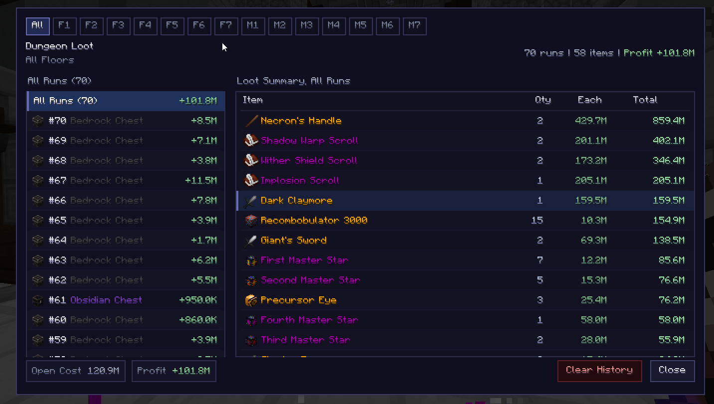

# DungeonRunTracker [DRT]

A Hypixel SkyBlock mod that tracks dungeon runs and loot.

## Screenshots



## Features

- **Run tracker HUD** - displays run count, current floor, and cumulative profit directly on your screen
- **Loot logging** - automatically records every dungeon chest opening, including cost, items, and profit
- **Loot history screen** - browse all past runs filtered by floor, sort by item value, and search loot entries
- **Live pricing** - item prices fetched from the auction house in real time, with fallback to BIN data
- **Skull textures** - item icons resolved from the NEU repo for accurate in-game appearance
- **Draggable HUD** - reposition the tracker anywhere on screen with `/drt move`

## Commands

| Command | Description |
|---|---|
| `/drt move` | Open the position screen to drag the HUD |
| `/drt loot` | Open the loot history screen |

You can also click the profit line on the HUD to open the loot history screen directly.

## Installation

1. Install [Fabric Loader](https://fabricmc.net/use/installer/) for Minecraft 1.21.11
2. Install [Fabric API](https://modrinth.com/mod/fabric-api)
3. Drop `DungeonRunTracker-1.0.0.jar` into your `mods/` folder

## Building

```bash
./gradlew build
```

Output: `build/libs/DungeonRunTracker-1.0.0.jar`

## Requirements

- Minecraft 1.21.11
- Fabric Loader 0.19.2+
- Fabric API
- Java 21+
